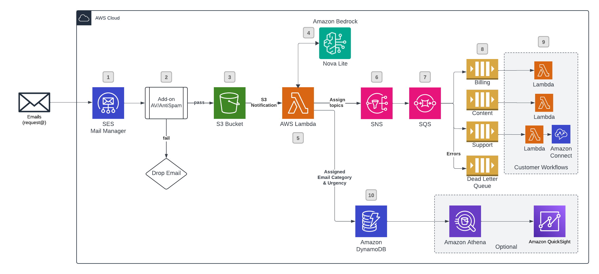

# GenAI Email Categorization Using SES Mail Manager

>**BE AWARE:** This code base is an [Open Source](LICENSE) starter project designed to provide a demonstration and a base to start from for specific use cases. 
It should not be considered fully Production-ready.
If you plan to deploy and use this in a Production environment please review the [Using this in Production](#using-this-in-production) section at the end for some additional guidance.

## Use-case scenario

Allows customers to use GenAI to categorize incoming emails and assign an urgency so that processing can be handled different for each category and urgency. For example, urgent emails could have an Amazon Connect outboud call initiated so a Customer Service agent can reach out directly.  Non-urgent emails can have a Connect Task created so Agents can work through a queue of inbound emails.

This Solution will configure the following:
- S3 Bucket to receive inbound email messages
- S3 Lambda Notifications when new objects are saved to S3
- Lambda function that parses MIME emails saved to the S3 bucket
- SES Mail Manager Traffic Policy, Rule Set, and Ingress Point configured to write to S3 Bucket
- SNS Topics and SQS Queues for each category along with a sample Lambda function that just logs the email to CloudWatch.  You will want to replace this with your own Lambda function that will process the email accordingly.

>**NOTE:** You will need the ability to manage Mail Exchange (MX) Domain Name Service (DNS) records for your domain to test this solution.   Modifying MX records can impact email receiving for your primary domain. It is HIGHLY recommended to create a subdomain (i.e. testing.example.com) to avoid impacting any email receiving on your primary domain (example.com) 

### Solution architecture:  

1. Amazon Simple Email Service (SES) Mail Manager will accept inbound email and route the email through the rules and actions necessary to process the email.  
2. In this case one of the available addons will be used to scan for viruses/spam and drop the email.  
3. If the email is free of viruses/spam it will be saved to Amazon Simple Storage Service (S3) Using S3 Notifications an AWS Lambda Function will be called.
4. The AWS Lambda function will ask the GenAI model in Amazon Bedrock to categorize the email and assign an urgency.  
5. The Lambda function will send a notification to the respective Amazon Simple Notification Service (SNS) topic for the category
6. Amazon SNS Topics will be created for each category.
7. Amazon Simple Queue Service (SQS) Queues will be created for each category. 
8. The Amazon SQS queues are subscribed to the corresponding SNS Topics.
9. Example AWS Lambda functions are created to process the Amazon SQS queues for each category. Customers can modify the function code to take action on the email.  For example, Amazon Connect tasks could be created for each support request or an Amazon Connect outbound call can be created for urgent support requests.
10. Email information along with the assigned category and urgency will be stored in Amazon DynamoDB table. Customers can optionally use this information to feed into Amazon QuickSight or Amazon Athena for ad-hoc queries or data visualization.

## Solution prerequisites
* AWS Account
* AWS IAM user with Administrator permissions
* Amazon Bedrock [models enabled](https://docs.aws.amazon.com/bedrock/latest/userguide/model-access-modify.html): Amazon Nova Micro
* [Amazon SES](https://aws.amazon.com/ses/) with an email or domain that has [been verified](https://docs.aws.amazon.com/ses/latest/dg/creating-identities.html)
* [Amazon SES Mail Manager Vade Add-on](https://docs.aws.amazon.com/ses/latest/dg/eb-addons.html) This solution uses the Vade Mail Manager Addon to scan for Virus and Spam.  You will need to enable the Add-On in the SES Mail Manager console.  

> Note: This Add-On has an additional cost.

* Node (> v18) and NPM (> v8.19) [installed and configured on your computer](https://nodejs.org/en/download/package-manager)
* AWS CLI (v2) [installed and configured on your computer](https://docs.aws.amazon.com/cli/latest/userguide/getting-started-install.html)
* AWS CDK (v2) [installed and configured on your computer](https://docs.aws.amazon.com/cdk/v2/guide/getting_started.html#getting_started_install)

## Solution setup

The below instructions show how to deploy the solution using AWS CDK CLI.
These instructions assume you have completed all the prerequisites. If you are using a Windows device please use the Git BASH terminal and use alternative commands where highlighted.

1. Clone the solution to your computer (using `git clone`)

2. Check AWS CLI
    - AWS CDK will use AWS CLI local credentials and region. These can be either
      - environment variables (AWS_ACCESS_KEY_ID AWS_SECRET_ACCESS_KEY, AWS_SESSION_TOKEN, AWS_DEFAULT_REGION) set directly in the command line
      - from a [credentials file](https://docs.aws.amazon.com/cli/latest/userguide/cli-configure-files.html), either using the default profile or setting a specific one (i.e. `export AWS_PROFILE=yourProfile`)
    - check your AWS CLI configuration by running any AWS CLI command (e.g. `aws s3 ls`)
    - you can confirm the configured region with  
            `aws ec2 describe-availability-zones --output text --query 'AvailabilityZones[0].[RegionName]'`
    - AWS SDK (used in the configure script in step 4) can use either the environment variables or credentials file/profile config, however note that the region environment variable in this case is AWS_REGION rather than AWS_DEFAULT_REGION (as used in awscli)

3. Install NPM packages
    - Run `npm install`

4. Enable Vade Email Add-On **NOTE: This AddOn has an additional Cost**
    - In the SES Console Select `Email add-ons` from the **Mail Manager** menu on the left
    - Select the **Vade** Add-on and select **Learn More**
    - Review the Subscription information including costs.
    - Click the **Subscribe** button
    - After Subscribing copy the **Add-on instance ARN** as it will be used in the step below.

5. Deploy CDK stack
    - If you have started with a new environment, please bootstrap CDK: `cdk bootstrap`
    - By default the solution defines the following categories (techsupport, billing, content, and unknown)  If you want different categories: Update the `context.emailCategories` in the `cdk.json` file with the categories you want to use.  If you update this, you will need to update the categories in the [Bedrock LLM prompt](./lib/llminstructions.txt) accordingly.  If these ever change, you will need to update and redeploy the stack so that SNS topics are created with the new categories.
    - Run `cdk deploy --parameters allowListedEmailAddress="Email Address" --parameters vadeAddonARN="[ADD-ON ARN FROM VADE STEP ABOVE]"` 
    - Parameter Information
        - **allowListedEmailAddress** - The allow listed inbound email address.  This solution will setup an initial Mail Manager Traffic Policy to allow emails to a specific email address.  Please enter an initial email address here.  You can adjust the Traffic Policy as needed following deployment. i.e. support@example.com
        - **vadeAddonARN** - The Vade Add-On URL from the Step Above. i.e. arn:aws:ses:us-east-1:XXXXXXXXXXXX:addon-instance/xx-oy7zgm7znltbbfz7oXXXXXXX

6. Test the solution

>**NOTE:** You will need the ability to manage Mail Exchange (MX) Domain Name Service (DNS) records for your domain to test this solution.   Modifying MX records can impact email receiving for your primary domain. It is HIGHLY recommended to create a subdomain (i.e. testing.example.com) to avoid impacting any email receiving on your primary domain (example.com) 

- Update the MX DNS record for the selected subdomain record to the `ARecord` value output by the CDK Deployment.  You can also navigate to CloudFormation in the Console and select the newly created stack and navigate to the `Outputs` tab to see the Stack Outputs. NOTE: it could take several hours for DNS updates to propogate. [More Information](https://docs.aws.amazon.com/ses/latest/dg/eb-ingress.html) on the `A Record` output by the solution.
- Send a test email to the email address you configured in Step 4.
    - **Subject**: Poor Video Quality
    - **Body**: Hello, The video quality on Octank Video Streaming is often very poor. It gets pixelated and difficult to watch Can you do something to improve this? Thanks, Jane Smith
- Check that the email is stored in the S3 Bucket configured by the solution (The S3 bucket name is available in the `Outputs` tab.)
- Check that a record was added to the DynamoDB table with the LLM assigned category and urgency (The name of the DynamoDB table is available in the `Outputs` tab.)
- Navigate to the Lambda Function `echoSNSToConsoleTechSupport` and check the CloudWatch logs for the contents of the email and the category and urgency assigned by the LLM.

7. Configure Alarm Actions/Notifications (Optional, but Recommended)
    - The solution will automatically create metrics to track errors while processing emails. Cloudwatch Alarms have also been configured. You can optionally setup actions on the alarm to get notifications if there are errors.
    - Make note of the Alarm names that are output by the CDK deployment. You can also open up the CloudFormation Stack and goto the `Outputs` tab to see the Alarm name.
    - Open the alarm in the CloudWatch console.
    - Configure an Action for the alarm, i.e. [setup an SNS notification](https://docs.aws.amazon.com/AmazonCloudWatch/latest/monitoring/Notify_Users_Alarm_Changes.html) to receive Emails for the Alarm

## Using different Bedrock Models
The solution works with the following Bedrock Models:

- amazon.nova-micro-v1:0 (Default)
- amazon.nova-lite-v1:0 
- anthropic.claude-3-sonnet-20240229-v1:0
- anthropic.claude-3-haiku-20240307-v1:0

You can experiment with different models by updating the `bedrockModelId` value in the Configuration DynamoDB table.  The table name is exported by the CloudFormation stack and can be found by searching for: `SettingsDynamoDBTableName` in the CloudFormation Outputs Tab.

> Note: that you may need to adjust the [Bedrock LLM prompt](./lib/llminstructions.txt) or other parameters to optimize for the models specific capabilities and response format, as it might handle prompts differently.

## Troubleshooting
- If you don't receive data in the DynamoDB table, SNS, or SQS, please check the following:
    - Inspect the CloudWatch Logs for the `emailHandlerLambda` Lambda function to ensure it is processing messages correctly

## Clean up

To remove the solution from your account, please follow these steps:

1. Remove CDK Stacks
    - Run `cdk destroy --all`

## Using this in Production

It is critical that before you use any of this code in Production that you work with your own internal Security and Governance teams to get the appropriate Code and AppSec reviews for your organization. 

Although the code has been written with best practices in mind, your own company may require different ones, or have additional rules and restrictions.

You take full ownership and responsibility for the code running in your environment, and are free to make whatever changes you need to.

> NOTE: this solution creates an SQS Dead Letter Queue for any processing errors in SQS. You will want to configure an [Alert on failures]"(https://docs.aws.amazon.com/AWSSimpleQueueService/latest/SQSDeveloperGuide/dead-letter-queues-alarms-cloudwatch.html) and/or [redrive queues](https://docs.aws.amazon.com/AWSSimpleQueueService/latest/SQSDeveloperGuide/sqs-configure-dead-letter-queue-redrive.html) automatically when vailures occur.  

**Some of the things you will want to consider**
- The starter project creates an S3 bucket to store incoming emails.  You may want to use [Amazon Macie](https://docs.aws.amazon.com/macie/latest/user/what-is-macie.html) to assist in discovery of potentially sensitive data in S3 buckets.  Amazon Macie can assist in discovery of potentially sensitive data in S3 buckets, and can be enabled on a free trial for 30 days, up to 150GB per account.
The data in S3 will also remain until deleted.  Based on your particular data retention and information security policies, you should consider using [S3 Lifecycle](https://docs.aws.amazon.com/AmazonS3/latest/userguide/object-lifecycle-mgmt.html) policies to delete or move the data to cheaper forms of storage such as [Amazon S3 Glacier](https://aws.amazon.com/pm/s3-glacier).
- There is the potential for end users to send Personal Identifiable Information (PII) in messages. You may want to use [Amazon Comprehend](https://docs.aws.amazon.com/comprehend/latest/dg/what-is.html) to assist in redacting PII before storing messages in S3 or DynamoDB. The following blog post provides a good overview of how to use Comprehend to redact PII: [Redact sensitive data from streaming data in near-real time using Amazon Comprehend and Amazon Kinesis Data Firehose.](https://aws.amazon.com/blogs/machine-learning/redact-sensitive-data-from-streaming-data-in-near-real-time-using-amazon-comprehend-and-amazon-kinesis-data-firehose/)

You can also look to use [Bedrock Guardrails](https://aws.amazon.com/bedrock/guardrails/) to help with PII redaction.  See: https://docs.aws.amazon.com/bedrock/latest/userguide/guardrails-sensitive-filters.html
- Consider enabling model invocation logging and set alerts to ensure adherence to any responsible AI policies. - Model invocation logging is disabled by default. See https://docs.aws.amazon.com/bedrock/latest/userguide/model-invocation-logging.html
- Bedrock Guardrails - A customer may want to restrict Bedrock output for compliance, abuse mitigation, or other data restrictions. Guardrails for Amazon Bedrock, AWS Lambda, or AWS Comprehend may be good candidates to redirect and filter Bedrock output. See https://aws.amazon.com/bedrock/guardrails/
- The starter project has extensive logging to CloudWatch, but does not have any monitoring or tracing included, you may want to look at using tools like Cloudwatch Alarms and X-ray.

## Useful commands

* `npm run build`   compile typescript to js
* `npm run watch`   watch for changes and compile
* `npm run test`    perform the jest unit tests
* `npx cdk deploy`  deploy this stack to your default AWS account/region
* `npx cdk diff`    compare deployed stack with current state
* `npx cdk synth`   emits the synthesized CloudFormation template
